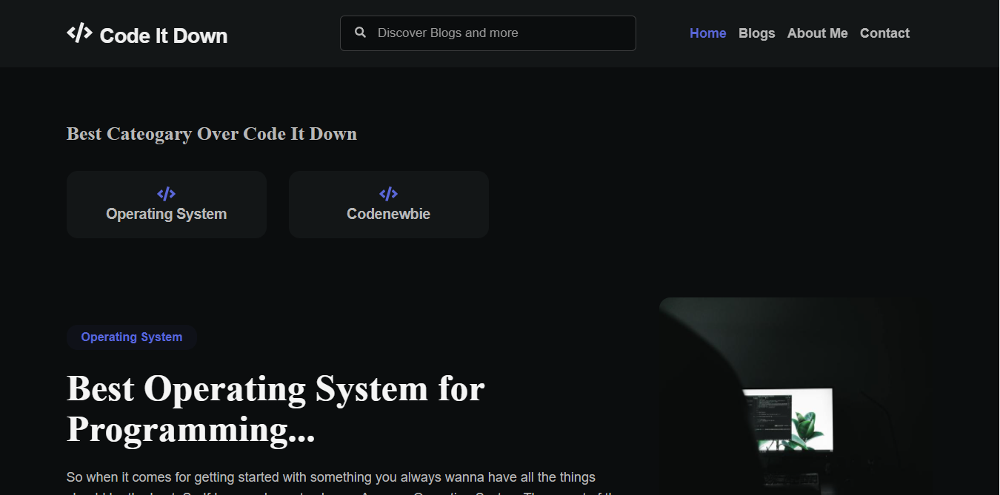

# Code It Down


### This blog is developed with [Next.js](https://nextjs.org/) and [Django](https://www.djangoproject.com/).<br /><br />

## Topic suggestions
Please write a [E-mail](mailto:coderaman07@gmail.com) to me on which you would like to see the change or any Blog Post or you can directly contact me [here](https://codeitdown.vercel.app/contact) and write your Suggestions.<br /><br />

## Steps to get it running:
<br />

### 1. Fork this repo and Clone the Repo<br /><br />

### 2. `npm i`<br /><br />

### 3. Develop you Own Backend System or Connect it with your personal Favoraite CMS ( I prefer Dev.to and Agility CMS)<br /><br />

    You can also get a Backend System Developed by me and that will be the same which is being Used in this Blog App<br /><br />

### 4. To create a new post Move to the Particular Backend System or CMS whichever you are using and make a new Post over there<br /><br />

### 5. The DB Schema is coming Soon... [ Be Sure to Star this Repo to get Updated ]<br /><br />

### 6. Add the Cateogary in which your Blog suits the best<br /><br />

### 7. Add a hashtag so that it can be filtered.

    Note: Make sure to Add that Hashtag in the Popular Hashtag Table

### To add multiple tags:

    Keep on Filling the Entries which is asked from you else just leave the blank ( except the first One)

### 8. Add your name as the last tag (after the word `by`):
    To Add your Name you have to Edit the Index.json file present in [ components\DataFetching\index.js ]


    Note: Make sure you Edit Each and Every Detail else It will serve My Data to your Readers<br /><br />

### 9. Turn on the server: `npm run dev` (The Default Port which is being used by Next.js is 3000) ( *If the Default Port is busy with Node.js then do use this command ```npm run dev -- -p 4000```* )<br /><br />

### 10. Preview your Blog at: [localhost:3000](http://localhost:3000)

*If you ran ```npm run dev``` else you have to type the port that you used above*<br /><br />

### 11. Once you're satisfied with your changes, visit the Blog at the Desired Port or the Default Port

----

## Steps to go live:<br /><br />

### 12. To Go live You have to Create a Free Account on [Vercel](https://vercel.com/)<br /><br />

### 13. Then there Create your Project and Connect Your Github Account with Vercel<br /><br />

### 14. Hit Next and Sit back and Relax and Vercel will take care of Everything unless you have anything Syntactical Error<br /><br />

### 15. One time setup:

* `Change your Domain Name to your dezired domain ( if using a free one like me )`<br /><br />

### 16. The Vercel Always takes a Look on your Main/Master branch of the GitHub Repo <br /><br />

( *So You can Update your Blog ( If you want to ) and push that Update to another Branch and it will still not Break you Blog App* )<br /><br />

## Adding Images
To Add Images you must add the Domain Name of the Backend System or the CMS's in next.config.js file else it will not load the Images *( Next.js Security you can also Disable this but it's recommended )*<br /><br />

## Code Highlighting

### Backtick code block

    ``` 

        code snippet

    ```


## *Happy blogging!*

***************************
#### Got questions? Contact [@jdaudier](https://github.com/coderaman07) at [Code it Down](https://codeitdown.vercel.app/contact)